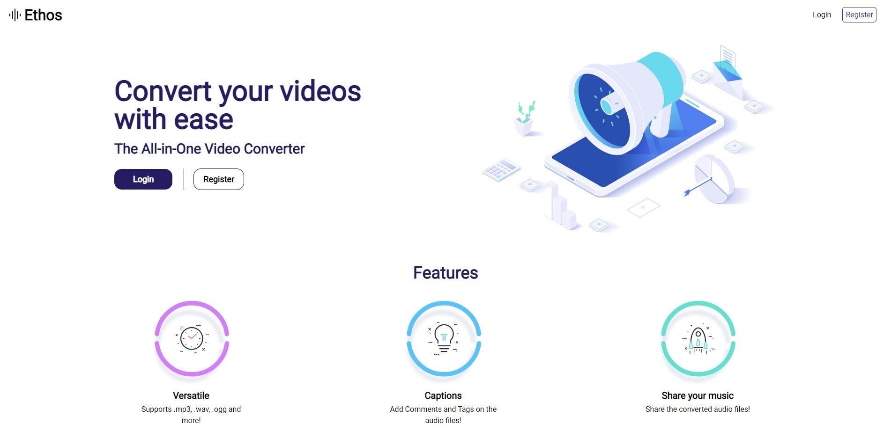

<h2 align="center">Ethos Software Challenge</h2>
<h3 align="center">Saptang Software Dev</h3>
     
  

   A web application that converts online videos to audio and enables the user to add tags or comments to specific timestamps in the audio.
     
     
  

<!-- ABOUT THE PROJECT -->
 
 

 
 

(<a href="#top">back to top</a>)

### Built With

* [NodeJS](https://nodejs.org/en/docs/)
* [ExpressJS](https://expressjs.com/)
* [Python](https://docs.python.org/3/)
* [MongoDB](https://www.mongodb.com/docs/)
* [TailWindCSS](https://tailwindcss.com/)

(<a href="#top">back to top</a>)

<!-- GETTING STARTED -->
## Getting Started

## Requirements

For development, you will only need Node.js and a node global package, npm, installed in your environement.

### Node
- #### Node installation on Windows

  Just go on [official Node.js website](https://nodejs.org/) and download the installer.
Also, be sure to have `git` available in your PATH, `npm` might need it (You can find git [here](https://git-scm.com/)).

- #### Node installation on Ubuntu

  You can install nodejs and npm easily with apt install, just run the following commands.

      $ sudo apt install nodejs
      $ sudo apt install npm

- #### Other Operating Systems
  You can find more information about the installation on the [official Node.js website](https://nodejs.org/) and the [official NPM website](https://npmjs.org/).

If the installation was successful, you should be able to run the following command.

    $ node --version
    v8.11.3

    $ npm --version
    6.1.0

If you need to update `npm`, you can make it using `npm`! Cool right? After running the following command, just open again the command line and be happy.

    $ npm install npm -g

###

---

## Install

    $ git clone https://github.com/mortal-ghost/ethos-software-challenge.git
    $ cd ethos-software-challenge
    $ npm install

## Running the project

    $ npm run dev

<!-- ## Simple build for production

    $ yarn build -->
    

(<a href="#top">back to top</a>)

<!-- USAGE EXAMPLES -->
## Usage

Create an account and login to access the user dashboard

 

 
 
<strong>Username</strong> : hellora
 
<strong>Password</strong> : bye
 
 
You will be by the user dashboard
 
 

 
 
Click on the "+" button in the bottom right corner to create a new project, or access a pre-existing one from the dashboard 
 

(<a href="#top">back to top</a>)

<!-- FEATURES -->
## Features

  - Verstatile
    - Supports a wide range of video and audio file extensions.
  
  - Comments and Tags
    - Add comments and tags on specific Timestamps
    - Added comments are highlighted on the music player
  
  - Search
    - Very fast search to find all comments with a tag
  

(<a href="#top">back to top</a>)

